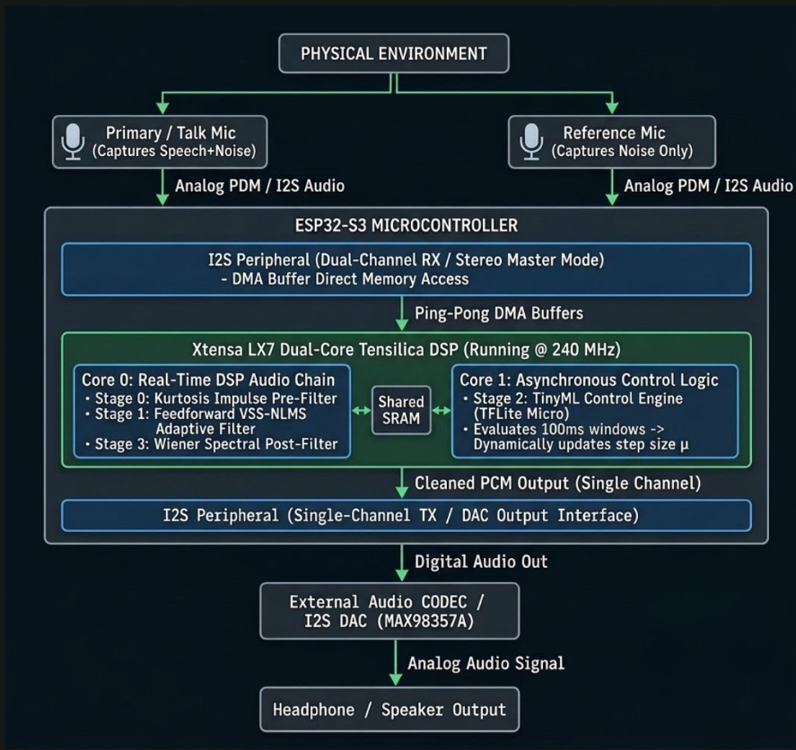
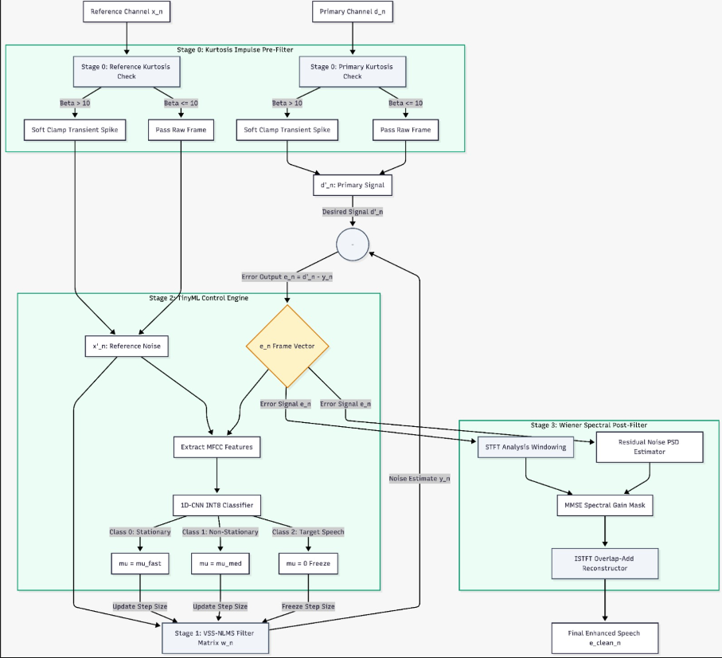
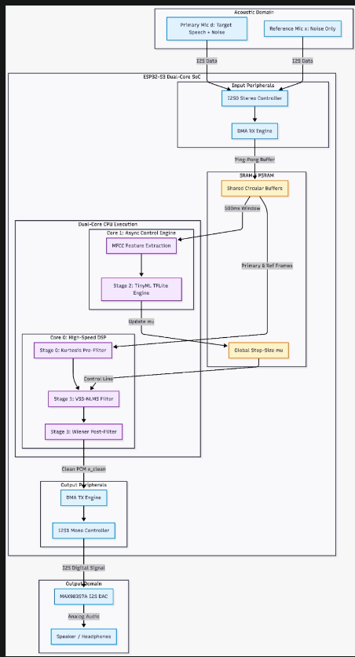
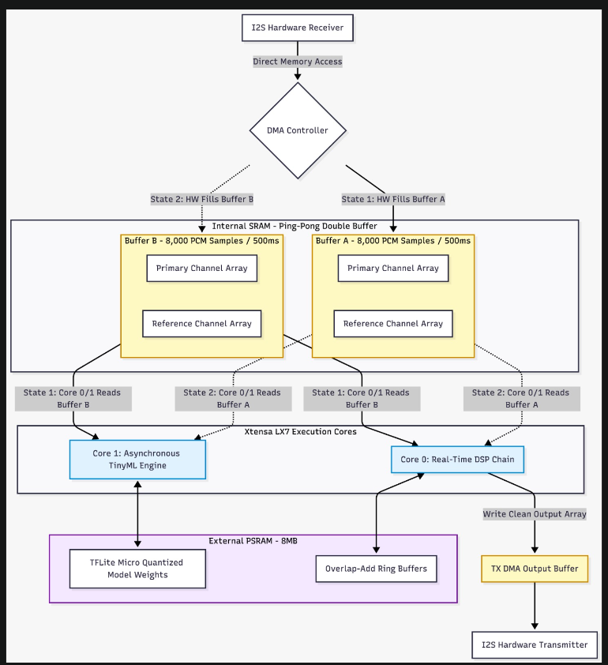
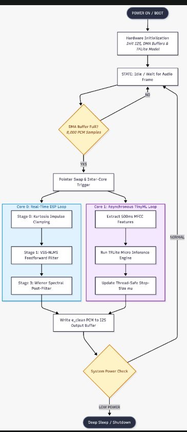

# Architecture Documentation

Here are the architecture diagrams and execution flows for the project:

## Overall Architecture

## Signal Processing Architecture

## System Architecture

## Buffer Architecture

## Execution Flow

